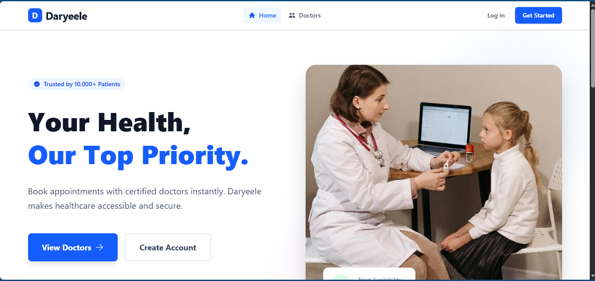

# 🏥 Daryeele – Smart Healthcare Booking Platform

> Daryeele is a healthcare website built with React JS as the final project of my React journey at Dugsiiye. It provides a modern solution for patients to book appointments online instead of waiting at hospitals, and helps users easily find different doctors.

---

## 🚀 Tech Stack

| Layer | Technology |
|-------|------------|
| UI Framework | React + Vite |
| Styling | Tailwind CSS |
| State Management | Context API + useReducer |
| Routing | React Router |
| Backend | Supabase |

---

## 👥 User Roles

### 🧑 Patient (user)
- Browse all doctors
- View doctor profiles and reviews
- Book appointments
- View and cancel upcoming appointments

### 🩺 Doctor
- Doctor view all his appointments
- Confirm / cancle / complete appointments
- Earnings summary

### ⚙️ Admin
- Add a doctor
- Manage doctors

---

## 📝 License

MIT

---

## 📸 Preview

